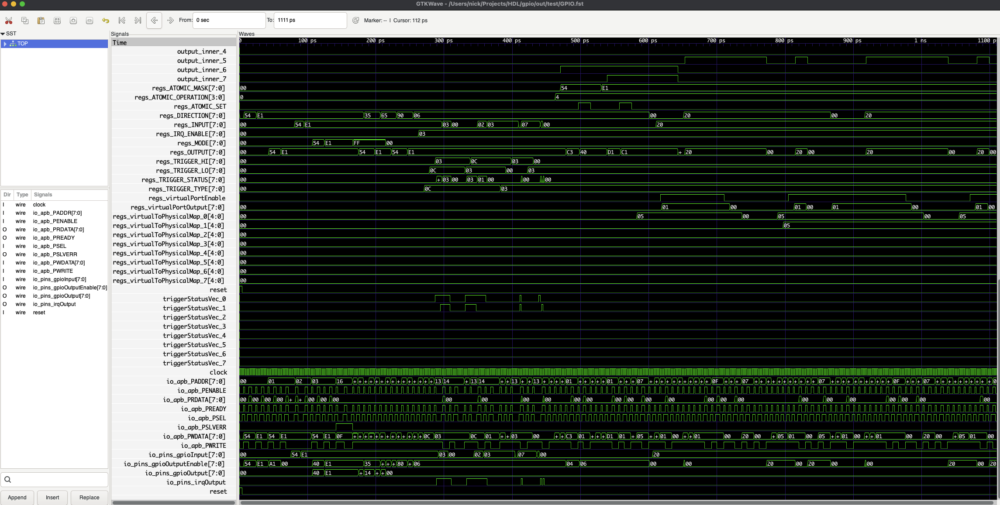

# Chisel Project Template

## Usage

### Prerequisites

Run the following command to setup the prerequisite environment for the project:
```bash
source config.sh
```


### Generate Verilog

To generate verilog from the chisel code, run the following command:

```bash
make verilog
```

The generated verilog will be in under the $BUILD_ROOT/verilog directory.

### Run Tests

Run the following command to run all tests:

```bash
make test
```

### View Waveforms

To view waveforms, run the following command:

```bash
gtkwave $BUILD_ROOT/test/$TOP.fst
```

It shoud look similar to this:


### Coverage

**TODO**

### Synthesis

To synthesize the design, run the following command:

```bash
make synth
```

This will generate a synthesized netlist in the $BUILD_ROOT/synth directory.

### STA

To run static timing analysis, run the following command:

```bash
make sta
```

This will generate a timing report in the $BUILD_ROOT/sta directory.

#### SDC File

STA requires an SDC file to define the constraints of the design. The SDC file is dynamically generated based on the design. It is generated into the $BUILD_ROOT/synth directory.

If you would like to generate this manually, run the following command:

```bash
python3 synth/sdc.py --top Gpio --out out/sta/Gpio.sdc --clock clock=5.0
```

- Top is the name of the top module
- Clock is the name of the clock signal and the period of the clock
- Out is the output file

## Development

### IDE

Recommended IDE is VSCode

#### Plugins

Recommended Plugins are:

- Prettier
- Scala Syntax (Official)
- Scala (Metals)

### Dependancies

#### The Easy Way (Nix)

If you are using the nix package manager, the simplest way to get setup is by running sh dev_shell.sh

Dependancies can be found in flake.nix, can use nix to install dependancies with `sh dev_shell.sh` from the root of the project.

#### Manually

If not using nix, the following dependancies are required:

- sbt
- scala-cli
- scalafmt
- chisel 5.3.0
- firtool 1.44.0
- sbt-scoverage
- verilator
- ninja
- cmake
- opensta
- yosys
- gtkwave
- iverilog
- latex

Also note that you will need to source the config / setup script in the root of the project: `source config.sh`
